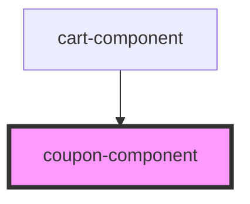

# coupon-component

<!-- Auto Generated Below -->

## Properties

| Property             | Attribute         | Description | Type                                                                                            | Default       |
| -------------------- | ----------------- | ----------- | ----------------------------------------------------------------------------------------------- | ------------- |
| `currency`           | `currency`        |             | `string`                                                                                        | `undefined`   |
| `discountAmount`     | `discount-amount` |             | `number`                                                                                        | `undefined`   |
| `handleCouponSubmit` | --                |             | `Function`                                                                                      | `() => {   }` |
| `selectedCoupon`     | --                |             | `{ id?: string; name?: string; label?: string; discount?: { type: string; amount: number; }; }` | `undefined`   |

## Dependencies

### Used by

 - [cart-component](../cart-component)

### Graph

----------------------------------------------

*Built with [StencilJS](https://stenciljs.com/)*
